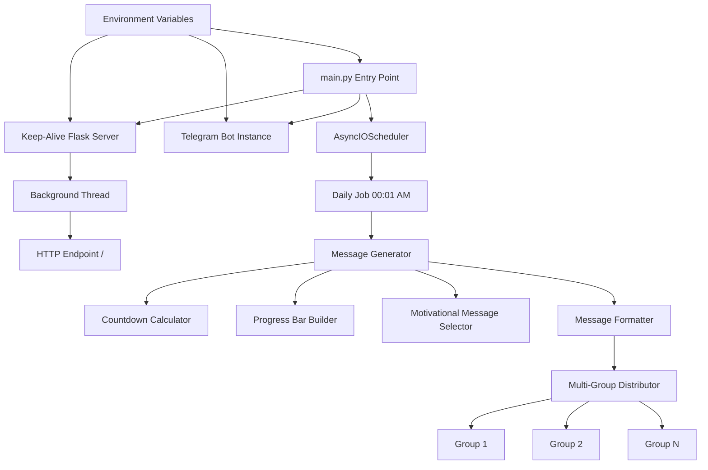

# Design Document

## Overview

The telegram-graduation-countdown-bot is a Python-based Telegram bot that automates daily motivational countdown messages to multiple class group chats. The system tracks progress from a start date (October 1, 2021) to graduation (June 27, 2026), providing students with visual progress indicators and motivational content.

The architecture consists of three main components:
1. **Message Generation System**: Calculates countdown metrics, generates progress bars, and formats messages
2. **Scheduling System**: Uses AsyncIOScheduler to trigger daily message distribution at 00:01 AM
3. **Keep-Alive Server**: A Flask HTTP server running in a background thread to maintain uptime on Render's platform

The bot is designed for deployment on Render's free tier, which requires an HTTP endpoint to prevent service hibernation. The Flask server satisfies this requirement while the main bot logic runs asynchronously.

## Architecture

### System Components



### Component Responsibilities

**Keep-Alive Server (Flask)**
- Runs in a separate daemon thread
- Listens on PORT environment variable (default: 8080)
- Responds to GET / with "Bot is active" status
- Prevents Render platform from hibernating the service

**Telegram Bot Instance**
- Initialized with TELEGRAM_BOT_TOKEN from environment
- Handles message sending to multiple groups
- Manages connection to Telegram API

**AsyncIOScheduler**
- Schedules daily job execution at 00:01 AM system time
- Runs in non-blocking mode alongside Flask server
- Triggers message generation and distribution

**Message Generator**
- Orchestrates countdown calculation, progress bar generation, and message formatting
- Composes final message structure
- Handles formatting errors gracefully

**Multi-Group Distributor**
- Parses GROUP_IDS from environment (comma-separated)
- Iterates through all group IDs
- Sends messages with error isolation (failure in one group doesn't affect others)
- Logs success/failure for each group

### Data Flow

1. **Initialization Phase**
   - Load environment variables (TELEGRAM_BOT_TOKEN, GROUP_IDS, PORT)
   - Start Flask server in background thread
   - Initialize Telegram bot instance
   - Configure and start AsyncIOScheduler

2. **Scheduled Execution Phase** (Daily at 00:01 AM)
   - Calculate days remaining: `graduation_date - current_date`
   - Calculate progress percentage: `(current_date - start_date) / (graduation_date - start_date) * 100`
   - Generate progress bar: Convert percentage to 10-block visual representation
   - Select motivational message
   - Format complete message with MarkdownV2 or HTML
   - Distribute to all groups with error handling

3. **Keep-Alive Phase** (Continuous)
   - Flask server responds to HTTP health checks
   - Maintains process activity for Render platform

## Components and Interfaces

### Configuration Module

**Purpose**: Centralize environment variable loading and validation

**Interface**:
```python
class Config:
    @staticmethod
    def get_bot_token() -> str:
        """Returns TELEGRAM_BOT_TOKEN or raises ValueError if missing"""
        
    @staticmethod
    def get_group_ids() -> list[str]:
        """Returns parsed list of group IDs from GROUP_IDS or raises ValueError"""
        
    @staticmethod
    def get_port() -> int:
        """Returns PORT as integer, defaults to 8080"""
```

**Responsibilities**:
- Validate required environment variables on startup
- Parse comma-separated GROUP_IDS into list
- Provide type-safe access to configuration values

### Countdown Calculator Module

**Purpose**: Calculate temporal metrics for countdown messages

**Interface**:
```python
class CountdownCalculator:
    START_DATE = date(2021, 10, 1)
    GRADUATION_DATE = date(2026, 6, 27)
    
    @staticmethod
    def days_remaining() -> int:
        """Returns days from today to graduation date, minimum 0"""
        
    @staticmethod
    def progress_percentage() -> float:
        """Returns percentage of time elapsed from start to graduation (0-100)"""
        
    @staticmethod
    def is_graduation_day() -> bool:
        """Returns True if today is graduation date"""
        
    @staticmethod
    def is_past_graduation() -> bool:
        """Returns True if today is after graduation date"""
```

**Responsibilities**:
- Encapsulate date constants
- Provide accurate date arithmetic
- Handle edge cases (graduation day, post-graduation)

### Progress Bar Builder Module

**Purpose**: Generate visual progress representation

**Interface**:
```python
class ProgressBarBuilder:
    FILLED_BLOCK = "🟦"
    EMPTY_BLOCK = "⬜"
    TOTAL_BLOCKS = 10
    
    @staticmethod
    def build(percentage: float) -> str:
        """Returns 10-block progress bar string based on percentage"""
```

**Responsibilities**:
- Convert percentage to block count (round to nearest 10%)
- Generate emoji string with filled and empty blocks
- Ensure exactly 10 blocks in output

### Motivational Message Selector Module

**Purpose**: Provide varied motivational content

**Interface**:
```python
class MotivationalMessageSelector:
    @staticmethod
    def get_message() -> str:
        """Returns a motivational message appropriate for software engineering students"""
```

**Responsibilities**:
- Maintain collection of software engineering-themed motivational quotes
- Select messages with variation across days
- Return appropriate message for context

**Implementation Note**: Can use simple rotation, random selection, or date-based selection to ensure variety.

### Message Formatter Module

**Purpose**: Compose and format the complete countdown message

**Interface**:
```python
class MessageFormatter:
    @staticmethod
    def format_countdown_message(
        days_remaining: int,
        progress_bar: str,
        motivational_message: str,
        is_graduation_day: bool = False,
        is_past_graduation: bool = False
    ) -> str:
        """Returns formatted message string with MarkdownV2 or HTML formatting"""
```

**Responsibilities**:
- Combine all message components into structured format
- Apply Telegram formatting (MarkdownV2 or HTML)
- Handle special cases (graduation day, post-graduation)
- Ensure proper escaping for chosen format

**Message Structure**:
```
🎓 Graduation Countdown 🎓

📅 Days Remaining: [X] days

Progress:
[Progress Bar]

💡 [Motivational Message]
```

### Message Distributor Module

**Purpose**: Send messages to multiple groups with error isolation

**Interface**:
```python
class MessageDistributor:
    def __init__(self, bot_token: str, group_ids: list[str]):
        """Initialize with bot token and target group IDs"""
        
    async def distribute_message(self, message: str) -> dict[str, bool]:
        """
        Send message to all groups.
        Returns dict mapping group_id to success status.
        Logs errors but continues on failure.
        """
```

**Responsibilities**:
- Initialize Telegram bot instance
- Iterate through all group IDs
- Send message to each group independently
- Log success/failure for each delivery
- Ensure failure in one group doesn't prevent delivery to others
- Complete within 60 seconds

### Keep-Alive Server Module

**Purpose**: Maintain HTTP endpoint for Render platform

**Interface**:
```python
class KeepAliveServer:
    def __init__(self, port: int = 8080):
        """Initialize Flask app with specified port"""
        
    def start(self):
        """Start Flask server in background daemon thread"""
        
    def health_check() -> tuple[str, int]:
        """Flask route handler for GET / returning ('Bot is active', 200)"""
```

**Responsibilities**:
- Create Flask application instance
- Define root endpoint returning status
- Run server in daemon thread (doesn't block main program)
- Listen on configured port

### Scheduler Module

**Purpose**: Trigger daily message sending at scheduled time

**Interface**:
```python
class DailyScheduler:
    def __init__(self, job_function: callable):
        """Initialize AsyncIOScheduler with job function"""
        
    def start(self):
        """Configure daily job at 00:01 AM and start scheduler"""
        
    async def execute_daily_job(self):
        """Job function that orchestrates message generation and distribution"""
```

**Responsibilities**:
- Initialize AsyncIOScheduler
- Configure cron-style daily trigger (00:01 AM)
- Execute message generation and distribution pipeline
- Handle and log scheduling errors

## Data Models

### Environment Configuration

**Structure**:
```python
TELEGRAM_BOT_TOKEN: str  # Required, format: "1234567890:ABCdefGHIjklMNOpqrsTUVwxyz"
GROUP_IDS: str           # Required, format: "-1001234567890,-1009876543210"
PORT: str                # Optional, format: "8080", default: "8080"
```

**Validation Rules**:
- TELEGRAM_BOT_TOKEN must be non-empty string
- GROUP_IDS must contain at least one group ID
- PORT must be parseable as integer in range 1-65535

### Message Components

**CountdownData**:
```python
{
    "days_remaining": int,        # 0 to ~1700 (days from Oct 2021 to Jun 2026)
    "progress_percentage": float, # 0.0 to 100.0
    "is_graduation_day": bool,
    "is_past_graduation": bool
}
```

**ProgressBar**:
```python
{
    "filled_blocks": int,   # 0 to 10
    "empty_blocks": int,    # 0 to 10
    "visual_string": str    # e.g., "🟦🟦🟦⬜⬜⬜⬜⬜⬜⬜"
}
```

**FormattedMessage**:
```python
{
    "content": str,           # Complete formatted message
    "parse_mode": str,        # "MarkdownV2" or "HTML"
    "timestamp": datetime     # When message was generated
}
```

### Distribution Results

**DeliveryResult**:
```python
{
    "group_id": str,
    "success": bool,
    "error_message": str | None,
    "timestamp": datetime
}
```

**DistributionSummary**:
```python
{
    "total_groups": int,
    "successful": int,
    "failed": int,
    "results": list[DeliveryResult],
    "duration_seconds": float
}
```

### Date Constants

```python
START_DATE = date(2021, 10, 1)      # Program start
GRADUATION_DATE = date(2026, 6, 27)  # Target graduation
TOTAL_DAYS = 1730                    # Days between start and graduation
```


## Correctness Properties

A property is a characteristic or behavior that should hold true across all valid executions of a system—essentially, a formal statement about what the system should do. Properties serve as the bridge between human-readable specifications and machine-verifiable correctness guarantees.

### Property 1: GROUP_IDS Parsing

For any comma-separated string of group identifiers, parsing the GROUP_IDS environment variable should produce a list where each element corresponds to a group ID from the input, with whitespace trimmed.

**Validates: Requirements 1.1**

### Property 2: Multi-Group Distribution

For any non-empty list of group identifiers, when the scheduled time arrives, the message distribution function should attempt to send the countdown message to each group ID in the list.

**Validates: Requirements 1.2**

### Property 3: Fault Tolerance

For any operation that encounters an error (message sending, formatting, or scheduling), the system should log the error with relevant details and continue executing remaining operations without termination.

**Validates: Requirements 1.3, 8.2, 8.4**

### Property 4: Days Remaining Calculation

For any current date, the calculated days remaining should equal the number of days between the current date and the graduation date (June 27, 2026), with a minimum value of 0.

**Validates: Requirements 2.1**

### Property 5: Progress Percentage Calculation

For any current date between the start date (October 1, 2021) and graduation date (June 27, 2026), the progress percentage should equal ((current_date - start_date) / (graduation_date - start_date)) * 100, clamped to the range [0, 100].

**Validates: Requirements 3.1**

### Property 6: Progress Bar Structure

For any percentage value, the generated progress bar should consist of exactly 10 blocks using only the 🟦 emoji (for filled blocks) and ⬜ emoji (for empty blocks), where filled_blocks + empty_blocks = 10.

**Validates: Requirements 3.2, 3.3**

### Property 7: Progress Bar Rounding

For any progress percentage, the number of filled blocks in the progress bar should equal round(percentage / 10), ensuring the percentage is rounded to the nearest 10% for block calculation.

**Validates: Requirements 3.6**

### Property 8: Message Variation

For any sequence of N consecutive days (where N > 1), the motivational messages generated should not all be identical—at least two different messages should appear in the sequence.

**Validates: Requirements 4.3**

### Property 9: Valid Format Mode

For any generated countdown message, the parse_mode should be either "MarkdownV2" or "HTML", ensuring compatibility with Telegram's formatting requirements.

**Validates: Requirements 5.1**

### Property 10: Message Completeness

For any generated countdown message, the message content should include all three required components: days remaining count, progress bar visualization, and motivational message text.

**Validates: Requirements 5.2, 2.2, 4.1**

### Property 11: Server Port Configuration

For any valid port number specified in the PORT environment variable, the Flask keep-alive server should listen on that port when started.

**Validates: Requirements 7.2**

### Property 12: Health Check Response

For any GET request to the root path (/) of the keep-alive server, the response should return the text "Bot is active" with HTTP status code 200.

**Validates: Requirements 7.4**

### Property 13: Delivery Logging

For any message delivery attempt to a group, the system should log an entry containing the group ID, success/failure status, and timestamp (plus error details if failed).

**Validates: Requirements 8.1, 8.3**

### Property 14: Environment Variable Reading

For any environment variable name (TELEGRAM_BOT_TOKEN, GROUP_IDS, or PORT), the configuration module should correctly read and return the value from the environment when the variable is set.

**Validates: Requirements 9.1, 9.2, 9.3**

### Property 15: Missing Variable Validation

For any required environment variable (TELEGRAM_BOT_TOKEN or GROUP_IDS), when the variable is not set or is empty, the bot should log an error message and fail to start (raise an exception or exit).

**Validates: Requirements 9.4**

## Error Handling

### Error Categories

**Configuration Errors** (Fatal - Prevent Startup)
- Missing TELEGRAM_BOT_TOKEN: Log error "TELEGRAM_BOT_TOKEN environment variable is required" and exit
- Missing GROUP_IDS: Log error "GROUP_IDS environment variable is required" and exit
- Invalid PORT value: Log error "PORT must be a valid integer" and exit
- Empty GROUP_IDS: Log error "GROUP_IDS must contain at least one group ID" and exit

**Network Errors** (Non-Fatal - Log and Continue)
- Telegram API connection failure: Log error with group ID and exception details, continue to next group
- Message send timeout: Log timeout error with group ID, continue to next group
- HTTP 429 rate limiting: Log rate limit error, continue to next group (consider implementing backoff in future)

**Calculation Errors** (Non-Fatal - Use Fallback)
- Date calculation exception: Log error, use fallback values (0 days remaining, 100% progress)
- Progress bar generation error: Log error, use fallback progress bar (10 empty blocks)
- Message formatting error: Log error, send plain text fallback message

**Scheduler Errors** (Non-Fatal - Log and Retry)
- Job execution exception: Log full stack trace, scheduler continues and will retry next day
- Scheduler initialization error: Log error, attempt to restart scheduler

### Error Logging Format

All errors should be logged with the following information:
- Timestamp (ISO 8601 format)
- Error level (ERROR, WARNING, INFO)
- Component name (e.g., "MessageDistributor", "CountdownCalculator")
- Error message
- Exception details (if applicable)
- Context information (e.g., group_id, current_date)

Example log format:
```
2024-01-15T00:01:23.456Z [ERROR] MessageDistributor: Failed to send message to group -1001234567890
Exception: telegram.error.NetworkError: Connection timeout
Context: {"group_id": "-1001234567890", "retry_count": 0}
```

### Recovery Strategies

**Message Distribution Failures**
- Isolate failures: Each group delivery is independent
- Continue on error: Failure in one group doesn't affect others
- Log all failures: Maintain audit trail for debugging
- No automatic retry: Wait for next scheduled execution

**Keep-Alive Server Failures**
- Flask server crash: Log error, main bot continues (Render may restart service)
- Port binding failure: Log error and exit (fatal - service cannot function)

**Scheduler Failures**
- Job execution error: Log error, scheduler continues, next execution proceeds normally
- Scheduler crash: Log error and attempt restart (if restart fails, service exits)

## Testing Strategy

### Dual Testing Approach

The testing strategy employs both unit tests and property-based tests to ensure comprehensive coverage:

**Unit Tests**: Verify specific examples, edge cases, and error conditions
- Specific date scenarios (graduation day, post-graduation, start date)
- Configuration validation with missing/invalid values
- HTTP endpoint responses
- Initialization sequences
- File presence and content (requirements.txt, Procfile)

**Property-Based Tests**: Verify universal properties across all inputs
- Date calculations with randomized dates
- Progress bar generation with random percentages
- Message formatting with random components
- Multi-group distribution with random group lists
- Environment variable parsing with random inputs

Together, these approaches provide comprehensive coverage: unit tests catch concrete bugs in specific scenarios, while property-based tests verify general correctness across the input space.

### Property-Based Testing Configuration

**Library**: Use `hypothesis` for Python property-based testing

**Test Configuration**:
- Minimum 100 iterations per property test (due to randomization)
- Each property test must reference its design document property
- Tag format: `# Feature: telegram-graduation-countdown-bot, Property {number}: {property_text}`

**Example Property Test Structure**:
```python
from hypothesis import given, strategies as st

# Feature: telegram-graduation-countdown-bot, Property 4: Days Remaining Calculation
@given(current_date=st.dates(min_value=date(2021, 10, 1), max_value=date(2030, 12, 31)))
def test_days_remaining_calculation(current_date):
    calculator = CountdownCalculator()
    days = calculator.days_remaining(current_date)
    expected = max(0, (date(2026, 6, 27) - current_date).days)
    assert days == expected
```

### Unit Test Coverage

**Configuration Module**
- Test valid environment variable reading
- Test missing required variables (TELEGRAM_BOT_TOKEN, GROUP_IDS)
- Test missing optional variable (PORT defaults to 8080)
- Test GROUP_IDS parsing with single and multiple IDs
- Test GROUP_IDS parsing with whitespace
- Test invalid PORT value handling

**Countdown Calculator Module**
- Test days remaining on various dates
- Test days remaining on graduation day (should be 0)
- Test days remaining after graduation (should be 0)
- Test progress percentage at start date (should be 0%)
- Test progress percentage at graduation date (should be 100%)
- Test progress percentage at midpoint

**Progress Bar Builder Module**
- Test 0% progress (10 empty blocks)
- Test 100% progress (10 filled blocks)
- Test 50% progress (5 filled, 5 empty)
- Test rounding behavior (14% -> 1 block, 15% -> 2 blocks)
- Test progress bar always has exactly 10 blocks
- Test progress bar only contains valid emoji

**Message Formatter Module**
- Test message includes all required components
- Test message format is valid (MarkdownV2 or HTML)
- Test special character escaping
- Test graduation day message
- Test post-graduation message

**Message Distributor Module**
- Test message sent to all groups in list
- Test error in one group doesn't affect others
- Test logging on success
- Test logging on failure
- Test empty group list handling

**Keep-Alive Server Module**
- Test server starts on configured port
- Test GET / returns "Bot is active" with status 200
- Test server runs in background thread
- Test server responds to multiple requests

**Scheduler Module**
- Test scheduler initializes with correct time (00:01 AM)
- Test scheduler uses system timezone
- Test job function is called on schedule trigger (use mock time)

### Integration Tests

**End-to-End Message Flow**
- Test complete flow from scheduler trigger to message delivery
- Use mock Telegram API to verify message content
- Verify all components integrate correctly

**Configuration to Execution**
- Test bot startup with valid configuration
- Test bot startup fails with invalid configuration
- Verify keep-alive server starts before main bot logic

**Error Scenarios**
- Test message distribution continues after single group failure
- Test scheduler continues after job execution error
- Test logging captures all error details

### Test Execution

**Local Development**:
```bash
# Run all tests
pytest

# Run with coverage
pytest --cov=. --cov-report=html

# Run only property tests
pytest -m property

# Run only unit tests
pytest -m unit
```

**CI/CD Pipeline**:
- Run full test suite on every commit
- Require 80% code coverage minimum
- Run property tests with increased iterations (500+) on main branch
- Verify requirements.txt and Procfile exist and are valid

### Test Data

**Date Ranges for Testing**:
- Before start date: September 30, 2021
- Start date: October 1, 2021
- Mid-program: January 1, 2024
- Near graduation: June 1, 2026
- Graduation day: June 27, 2026
- After graduation: July 1, 2026

**Sample Group IDs**:
- Single group: "-1001234567890"
- Multiple groups: "-1001234567890,-1009876543210,-1008765432109"
- With whitespace: "-1001234567890, -1009876543210 , -1008765432109"

**Sample Motivational Messages**:
- "Code is like humor. When you have to explain it, it's bad."
- "First, solve the problem. Then, write the code."
- "The best error message is the one that never shows up."

